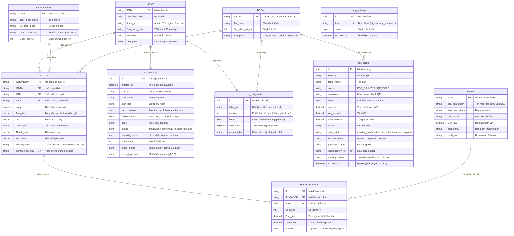

# Sơ Đồ Thực Thể Quan Hệ Cơ Sở Dữ Liệu (ERD)

**Hệ thống**: H2 MilkTea Management & POS System  
**Công nghệ lưu trữ**: PostgreSQL / Supabase  

---

```mermaid
erDiagram
    DSNV ||--o{ HOADON : "lập hóa đơn"
    DSNV ||--o{ ai_audit_logs : "thực thi lệnh AI"
    DSNV ||--o{ pos_cart_drafts : "sửa giỏ hàng"
    
    KHACHHANG ||--o{ HOADON : "mua hàng"
    
    DSBAN ||--o{ HOADON : "phục vụ tại bàn"
    DSBAN ||--o{ pos_orders : "nhận đơn tại bàn"
    DSBAN ||--o| pos_cart_drafts : "lưu nháp giỏ"
    
    HOADON ||--|{ HOADONDETAIL : "chứa các món"
    DMHH ||--o{ HOADONDETAIL : "định nghĩa món bán"
    
    DSNV {
        string IDNV PK "Mã nhân viên"
        string Ten_nhan_vien "Họ và tên"
        string Chuc_vu "Admin / Thu ngân / Pha chế"
        string Ten_dang_nhap "Tài khoản đăng nhập"
        string Mat_khau "Mật khẩu mã hóa"
        string Trang_thai "Hoạt động / Tạm khóa"
    }

    KHACHHANG {
        string IDKH PK "Mã khách hàng"
        string Ten_khach_hang "Tên khách"
        string So_dien_thoai "Số điện thoại"
        string Loai_khach_hang "Thường / VIP / Kim Cương"
        int Diem_tich_luy "Điểm thưởng tích lũy"
    }

    DMHH {
        string IDSP PK "Mã sản phẩm / món"
        string Ten_san_pham "Tên món (Trà sữa, Cà phê...)"
        string Loai_san_pham "Danh mục món"
        string Don_vi_tinh "Ly / Chai / Phần"
        decimal Don_gia "Đơn giá niêm yết"
        string Trang_thai "Đang bán / Ngừng bán"
        string Hinh_anh "Đường dẫn ảnh món"
    }

    DSBAN {
        string IDBAN PK "Mã bàn (1, 2, Khách mua về...)"
        string Ten_ban "Tên hiển thị bàn"
        int Suc_chua_toi_da "Số ghế tối đa"
        string Trang_thai "Trống / Đang có khách / Đặt trước"
    }

    HOADON {
        string IDHOADON PK "Mã hóa đơn bán lẻ"
        string IDBAN FK "Khóa ngoại bàn"
        string IDNV FK "Nhân viên thu ngân"
        string IDKH FK "Khách hàng thân thiết"
        datetime Ngay "Thời điểm thanh toán"
        decimal Tong_tien "Tổng tiền sau thuế và giảm giá"
        decimal VAT "Thuế VAT (10%)"
        decimal Giam_gia "Chiết khấu thành viên"
        decimal Thanh_toan "Tiền khách trả"
        decimal Tien_thua "Tiền thối lại khách"
        string Phuong_thuc "CASH / BANK_TRANSFER / VIETQR"
        string idempotency_key UK "Khóa chống trùng giao dịch"
    }

    HOADONDETAIL {
        string ID PK "Mã dòng chi tiết"
        string IDHOADON FK "Mã hóa đơn cha"
        string IDSP FK "Mã sản phẩm bán"
        int So_luong "Số lượng ly"
        decimal Don_gia "Đơn giá tại thời điểm bán"
        decimal Thanh_tien "Thành tiền dòng món"
        string Ghi_chu "Tùy chọn: size, đường, đá, topping"
    }

    pos_orders {
        uuid id PK "Mã đơn hàng"
        string table_id "Mã bàn đặt"
        string table_name "Tên bàn"
        string source "POS_COUNTER / QR_TABLE"
        string employee "Nhân viên / Khách QR"
        jsonb items "Chi tiết món kèm options"
        decimal subtotal "Tạm tính trước VAT"
        decimal vat_amount "Tiền VAT"
        decimal total_amount "Tổng thanh toán"
        string notes "Ghi chú đơn"
        string order_status "awaiting_confirmation / accepted / rejected / expired"
        string kitchen_status "queued / preparing / served"
        string payment_status "unpaid / paid"
        string idempotency_key UK "Mã chống gửi lặp"
        string tracking_token "Token bí mật để khách hủy đơn"
        datetime expires_at "Hạn duyệt đơn QR (15 phút)"
    }

    pos_cart_drafts {
        uuid id PK "Mã bản ghi draft"
        string table_id UK "Bàn liên kết (1 bàn = 1 draft)"
        int version "Phiên bản sửa giỏ (chống ghost cart)"
        jsonb items "Danh sách món trong giỏ nháp"
        datetime updated_at "Thời điểm cập nhật cuối"
        string updated_by "Nhân viên cập nhật gần nhất"
    }

    ai_audit_logs {
        uuid id PK "Mã log kiểm toán AI"
        datetime created_at "Thời điểm gửi câu lệnh"
        string staff_id "Mã nhân viên ra lệnh"
        string staff_name "Tên nhân viên"
        string staff_role "Vai trò thu ngân"
        text raw_message "Câu lệnh tự nhiên của nhân viên"
        jsonb parsed_action "Hành động AI phân tích được"
        string source "rule / llm / security"
        string status "previewed / confirmed / rejected / blocked"
        text blocked_reason "Lý do chặn vi phạm an toàn"
        int latency_ms "Độ trễ xử lý (ms)"
        string model_name "Tên mô hình (gemini-2.5-flash)"
        string prompt_version "Phiên bản prompt (v1.0.0)"
    }

    app_settings {
        uuid id PK "Mã cấu hình"
        string key UK "Tên cài đặt (ai_assistant_enabled...)"
        jsonb value "Giá trị cấu hình"
        datetime updated_at "Thời điểm cập nhật"
    }
```
